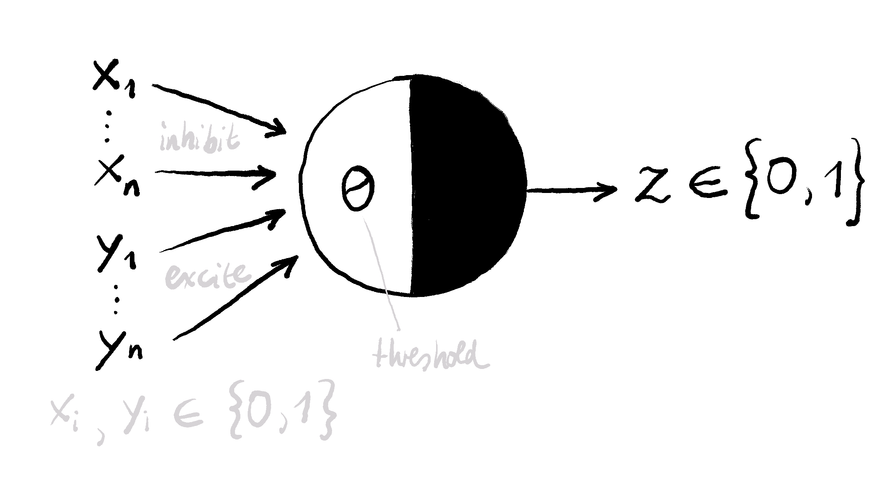

The following is a translated summary I wrote while working on the openHPI course [„Practical introduction to deep learning for computer vision“](https://open.hpi.de/courses/neuralnets2020). The students who setup the course did a great job and I can only recommend checking it out.

## It's red, it's round — must be a fly agaric!

Most people know how a computer basically works to do a job for you. A programmer designs algorithms and „hands“ them to the computer, which then executes them efficiently. This principle works very well to solve easily definable problems - e.g. to calculate taxes according to given rules. However, the programmer will have great difficulty in designing a suitable algorithm which can tell with a high certainty whether a given picture contains apples. For whom this task is not a problem, however, is ourselves - or rather our brain.

## How it all started

This problem was already noticed in the 1940s in the early days of IT — people started to think about how to mimic the human brain. But only since about 2006 has the right hardware and large amount of collected data enabled us to effectively pursue and research this option.

The human brain is basically a large tissue consisting of billions of nerve cells (neurons). These neurons communicate with each other via signals (chemical transmitters) which can either „inhibit“ or „excite“ such a cell. If a certain stimulus threshold of the neuron is exceeded, the neuron itself transmits these signals to neighbouring cells. This can result in very complex structures, which, for example, enable us to identify apples in a picture.

An early model (from 1943) that mathematically formalizes such a neuron is the McCulloch-Pitts model. It works based on excitatory and inhibitory inputs as well as a stimulus threshold - and thus maps the basic properties of a nerve cell. The model's so-called „neuron function“ yields 0 if an inhibitory signal is present or the stimulus threshold is not exceeded. The function returns 1 if the sum of the excitatory inputs is greater than or equal to the stimulus threshold.

With such a McCulloch-Pitts neuron, even basic logical operations such as AND, OR or NOT can be mapped. To be able to map more complex operations (starting with XOR, for example), several cells are required. However, at the beginning we do not know how many of these cells must be configured. Just as a child does not initially recognise the difference between the image of a fly agaric and an apple, it can quickly learn the difference from the information provided by its parents. During this learning process, new connections between the neurons are created and the stimulus thresholds of the cells adapt. Machine learning using neural networks works very similarly, except that new neurons are not usually added, but the weighting of their connections changes and activation thresholds are adjusted over time.

## Machine learning

Just as a small child absorbs new information like a sponge, artificial systems require large amounts of data. This data is used to „train“ the neural network and should therefore be as diverse and realistic as possible with regard to the application. Often data sets have to be labeled by hand so that the system can calculate how accurate its results are.

This is especially true for „supervised learning“ systems, which learn based on input and the desired results. However, there are also unsupervised learning systems that do not require predefined results. They are mostly used for data clustering or automated recognition of patterns in large amounts of data. The third type is so-called „reinforcement learning“ - these systems learn without input, but only based on the evaluation of their achieved results.

## About learning

In order to deliver results that are as accurate as possible, neural networks must be trained with the data sets described above and the parameters of the individual neurons must be adapted. The quality of the results can be determined using a so-called cost function - it describes how far the calculated result deviates from the expected result. The higher the deviation, the higher the „cost“ and thus less accurate the result. When we speak of machine learning, we therefore mean a minimization of the cost function.

So if the goal is to find the minimum of the cost function, can't we just calculate it? Not quite. For a simple function with only one parameter it is possible, but cost functions can have thousands of parameters. For this reason we use the „Gradient Descent“ method. A gradient indicates the slope of the cost function based on the given parameters. To approach the (local) minimum of the cost function, one can follow this gradient one step „down“ („descent“) and get to parameters that give more accurate results.

The multiple repetition of this process is called „machine learning“ — because knowledge is accumulated through the collection of experiences, for example the amount of the resulting „cost“. So if you train such a system long enough with meaningful data and provide it with the appropriate resources, eventually it will have the ability to evaluate data with similar certainty as the human brain. And to identify apples in pictures.

I got most of the information in this summary from the sources of the first week of the [openHPI course](https://open.hpi.de/courses/neuralnets2020), so check it out if you want to know more.
