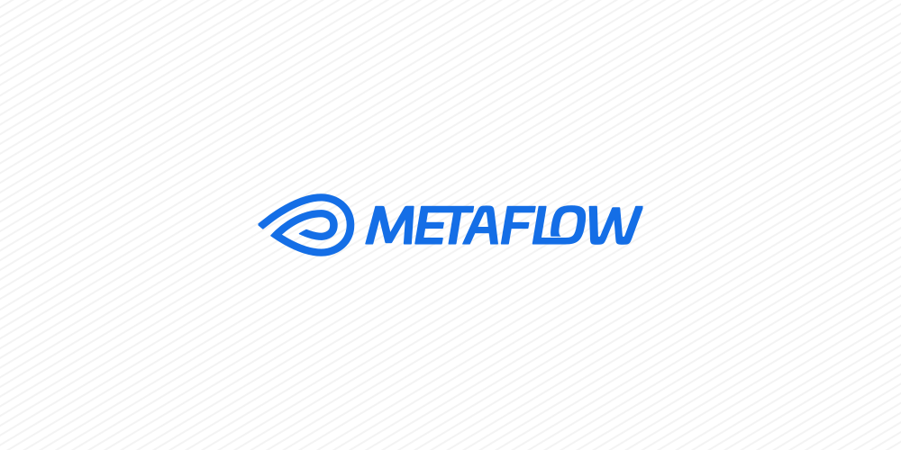

This summer, I had the opportunity to intern at SAP Singapore as a Data Engineer. The following is a short technical piece about the benefits and challenges I encountered when introducing Metaflow to automate evaluating the product my team worked on. The views expressed here are my own and do not necessarily reflect the views of SAP.

### What problem was there to solve?

Broadly speaking, the product my team works on helps customers structure their data. For that, various machine learning and algorithm-based models are used.

In the past, these approaches were evaluated individually and manually, but neither end-to-end nor automatically. Additionally, running evaluations were bound to individual machines, making them prone to interruptions. This also limited the shareability and reproducibility of results.

Ideally, we could bring all of these evaluations together into one pipeline and make results easily accessible to the team. This is where Metaflow comes in.

### What is Metaflow?

[Metaflow](https://metaflow.org/) is an open-source Python framework that allows building experimental workflows, iterate on them, and eventually bring them into production — all without having to worry about versioning results, reproducibility, or where things are run (locally or the cloud).

The way this works is that Metaflow allows us to specify “Flows” consisting of “Steps”. For example, I could create an “EvaluationFlow” which includes steps to evaluate the product:

```python
class EvaluationFlow(FlowSpec):
    @step
    def start(self):
        setupLogic()
        return self.next(self.evaluate)

    @step    
    def evaluate():
        evaluationLogic()
        return self.next(self.end)
    
    @step
    def end():
        cleanupLogic()
```

When executing a flow, Metaflow creates a concrete instance of the flow called a “Run” and will execute the flow’s steps as “Tasks”. Because of this data model, each execution becomes traceable. In case one of the tasks fails, we do not have to re-execute all previous tasks, but Metaflow can copy over the results of the previously successful tasks into a fresh run and only continue execution from the task that failed.

An interesting aspect of this design is that it allows for parallel executions. When referencing the next step in a flow, Metaflow allows to pass a list of arguments. For each of them, it will create a new task that can be executed in parallel. Eventually, a later step can merge results back together:

```python
class EvaluationFlow(FlowSpec):
    @step
    def start(self):
        ...
        self.numbers = [1, 2, 3]
        return self.next(self.evaluate, foreach="numbers")
        
    @step
    def evaluate(self):
        self.result = self.input + 1 # This task will be executed 3 times: for 1, 2 and 3
        return self.next(self.complete)
    
    @step
    def complete(self, inputs):
        print(sum([i.result for i in inputs])) # This will print 9 once the previous tasks have finished 
        return self.next(...)
```

You might have noticed that it seems that multiple parallel executions of the “evaluate” step would overwrite the “result” instance variable. But in the last step, we can access each one individually. This is due to how Metaflow handles so-called “artifacts”. Whenever we store something in an instance variable on the flow class, Metaflow will automatically serialize this data and store it in association with the task that created it. The next task will then only have access to data that originated from previous tasks (not parallel ones), because Metaflow will correctly deserialize the stored artifacts and make them available again on the instance. This mechanism allows for the “resume” feature I mentioned before, and even for inspection of all (intermediate) artifacts of a run through the Python library. 

### Evaluation Setup

We have multiple use cases within the product and different datasets that we want to evaluate. In this case, I decided to specify the configuration for the various evaluations in individual Yaml files. When running the flow, Metaflow allows us to pass in CLI parameters, which can be used to specify which evaluations to run.

In the first step, these “evaluation IDs” would get parsed and their configuration retrieved from the Yaml files.

Next, I use Metaflow’s branching feature to start a line of steps relevant only to this specific evaluation, such as creating a new API tenant, creating other required resources, and specifically sending all dataset samples (up to 1000s of them) through the API to then compare their results to the ground truth baseline from the specified dataset.

Then, I merge the different branches back together and consolidate the various evaluation results into one report that compares them and allows for further study if required. 

Last but not least, there is a step that checks if the evaluation metrics regressed from the last successful run, and if so, sends an automated message to a Slack channel through Slack’s workflow feature.

### Moving to the cloud

This process alone is not yet too different from the previous, simple script-based setup. However, Metaflow really shines when used in a cloud environment such as AWS. When configured accordingly, the metadata generated by creating runs is no longer stored locally, but in S3. This makes it possible for teams to easily share individual runs and retrieve previous results through a simple Python API.

Additionally, one can configure AWS Batch, which will allow Metaflow to execute individual steps not on one’s local machine, but as an AWS Batch Job. This way one can easily specify the required resources that AWS should provision the used job container with. In our case, this was perfect to avoid interruptions in long-running evaluation tasks.

Last, but not definitely not least, Metaflow provides a native integration with AWS Step Functions. Step Functions are state machines that allow the orchestration of AWS Batch Jobs. If this sounds similar to defining flows and running tasks, it’s not by coincidence. When deploying a step function, Metaflow converts the specified flow into a corresponding state machine, allowing AWS to orchestrate the execution of individual tasks by itself. This means I was able to setup up automatic triggers (in this case every week) that would start the evaluation flow, thereby allowing the team to get regular feedback on how the product is performing.

### Adding a visual interface

Since Metaflow can store all of its metadata in AWS, this means we can leverage this data not only through the Python library but also through a separate UI service that is part of the Metaflow ecosystem and can be deployed along the other infrastructure.

This is great since it allows all team members to quickly inspect their own runs and visit links of runs that others are sharing.

Besides that, the UI also makes another feature of Metaflow more accessible: “Cards”. A card is basically an HTML file that can be attached to each task and will be versioned with it. What makes this convenient is its integration with the library, as it is very easy to add text content or charts to this card report right from a step. For example, I added a table containing links to the API tenant used for a specific evaluation in the consolidation step (so one can quickly open it) as well as a bar chart comparing individual evaluation results.

So, after all the praise for Metaflow, what could be better?

### Things to improve

**Better support for enterprise environments**: When running flows with AWS Batch, Metaflow needs to ensure that your local Python environment is mirrored in the Batch job container. Ideally, this happens by specifying required Python packages and their versions for individual steps or flows, and Metaflow will then install and cache them for you. However, when operating from an enterprise environment, packages are often not publicly available and need to be downloaded from a private index requiring authentication. Metaflow did not support this at the time, so I had to build a custom Docker image containing the relevant environment, which Metaflow would then use on AWS Batch.

**Environment configuration for step functions:** It is not straightforward to configure the step function environment if one does not want to include the configuration by default in the Docker image. In our case, I had to dynamically adapt the default values of parameters depending on local environment variables, so that the deployed step function would respect these local environment variables. It would be nice if there was an easier way to pass in environment vars.

**Removing old data**: Currently, Metaflow provides no way to delete old runs and their artifacts through the CLI or Python library. The reason for that is that Metaflow stores artifacts in a content-addressed manner (locally or on S3) to minimize used space. So if two runs would generate the same artifact, the artifact would only be stored once. However, this also means that one cannot easily delete data from an old run, since its data might be required by a later run. However, since all of this is scoped to each flow, if one really needs to remove data, one could create a new flow and delete only the runs of the old one by removing its S3 directory. The community is currently discussing ways to introduce some form of garbage collection, but the concrete timeline for this feature is not clear.

### Summary

In this case, I ended up implementing two flows — one for evaluation and one that allows organizing and cleaning up old API resources. Metaflow proved very helpful because it allowed our team to easily access and share results, get regular feedback from automated evaluations, and leverage AWS compute resources quickly.

Based on feedback from the team and outsiders who saw the first evaluation reports, the integration was a full success.
